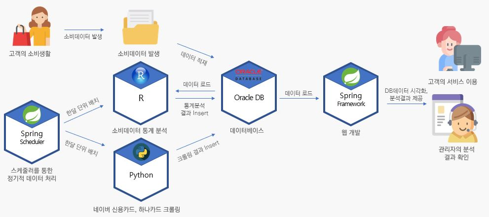

# 다이나믹하나:대시보드를 활용한 다이나믹 카드명세서

프로젝트 홈페이지 - https://koposoftware.github.io/2021_1_bskoo/

# 1. 프로젝트 개요

- 마이데이터 사업이 도입되면서 마이데이터에 대한 여러 기업의 관심과 투자가 증가하고 있고, 정보의 주체자인 고객에 맞게 개별적인 금융서비스 제공 필요가 증가하고 있습니다.
- 기존 하나카드의 앱은 거래내역 제공, 서비스 가입 등 제공하고 있는데, 이에 더하여 다이나믹하나를 통해 정보성 페이지 제공하여 고객에게 소비관련 인사이트 제공하고자 합니다.
- 데이터 분석을 통한 고객 군집 세분화 및 특징 추출하여, 각 군집에 맞는 상품 추천, 제공합니다.

# 2. 프로젝트 제안서
[발표자료](proposal.pdf) 

# 3. 주요 기능
* 사용자 기능
  * 나만의 카드
    * 고객이 원하는 혜택 기반 카드 검색
    * 고객의 지난달 소비 기반 예상 혜택 제공
  * 실시간 거래 내역서
    * 고객의 최근 90일 거래 내역 제공
    * 최근 거래 추세 제공
  * 월간 거래 리포트
    * 1 달간의 고객 소비 정리 , 메일링
    * 고객 소비에 최적화된 카드 추천
* 관리자 기능
  * 고객 대시보드
    * 고객의 시간대별 , 일간 , 월간의 거래량 비교
    * 가장 많이 사용된 카드 확인
  * 회원 분석
    * 매월 1 일 형성된 군집 정보 확인 군집의 주요 소비처와 군집 소속 회원 확인
    * 고객들의 인구통계학적 정보 제공
  * 안내 메일 발신
    * 형성된 고객 군집에 대해 추천 카드를 기반으로 한 메일링

# 4. 시스템 아키텍처
**<개발환경 및 시스템 아키텍처>**

**<서비스 아키텍처>**

# 5. 프로젝트 결과
**<사용자 페이지>**

**<관리자 페이지>**

## 발표 ppt 

[발표자료](final.pdf) 

## 시연 동영상 
<a href="https://youtu.be/qWUPHW-K_5w" target="_blank">[링크]</a>
<iframe id="ytplayer" type="text/html" width="640" height="360" src="https://youtu.be/qWUPHW-K_5w" frameborder="0"></iframe>

# 6. 본인 소개

|이름|구본성|
|:-----|:--|
|연락처|99bonseong@gmail.com|
|Frontend|HTML, CSS, JavaScript|
|Backend|Java, Python, R|
|Etc|SAS, VBA, Tableau|
|자격증|ADsP, SQLD, 사회조사분석사 2급, 정보처리기사, 빅데이터분석기사, ADP(필기)|
|경력|유진아이티서비스 인턴 (2020. 02 ~ 2020. 05)|
|교육이수|신한카드 빅데이터 썸머스쿨 (2018. 07 ~ 08) 엔코아 데이터 모델링 스쿨 (2019. 01) 빅데이터 활용을 위한 파이썬 프로그래밍 (2019. 07 ~ 08)|

# 7. 기타
- 서울시 빅데이터 캠퍼스에서 제공하는 `신한카드 소비데이터` 재구성 및 데이터 증폭
- `주성분 분석` 및 `군집분석`
- 대용량 데이터 `Index` 사용

 
